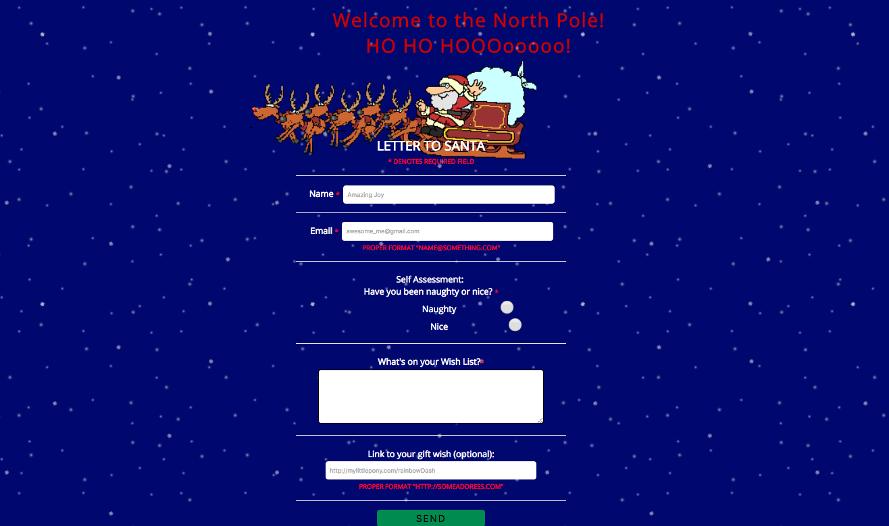

### First of all, Santa IS real!!!

Aaaaaaand he needs your help!

Since we live in the 21st century, snail mail is old school and Santa likes to keep up with the times.

So, in order to streamline his Christmas wish list processing, he wants all little kiddies in the world to submit their letter via HTML 5 form.

That's right. He's that cool.

Your mission is to use your imagination, creativity, and knowledge of CSS and HTML forms to do just that!

Santa only asks that you use at least 4 different HTML Form Elements and make it look pretty.

Submit your form and objectsArraysAndLoops assignment links via a GitHub issue. Hooray!
