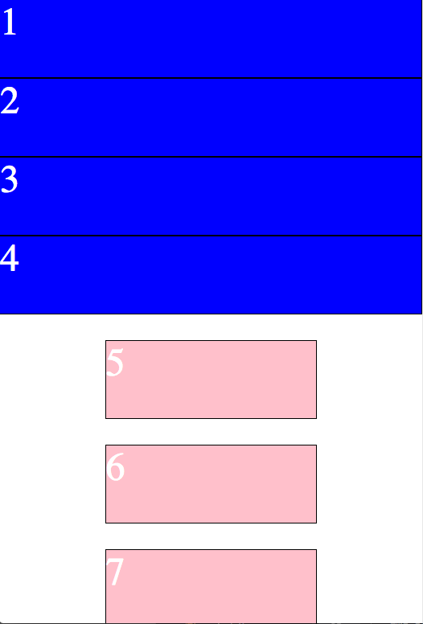
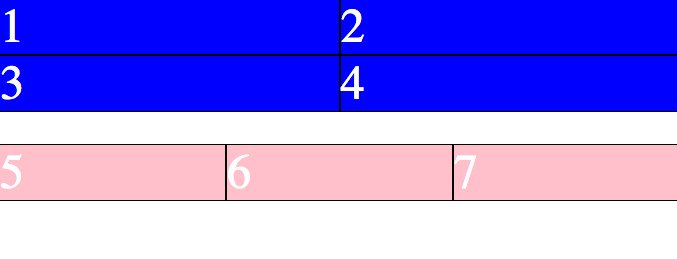
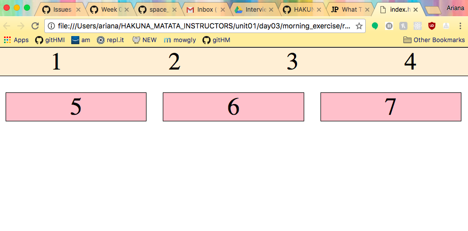

# Responsive Design


## What is responsive design?
Let's take a <a href="http://johnpolacek.github.io/scrolldeck.js/decks/responsive/">look!</a></br>

**Aspects to Take in Consideration**</br>
- screen size</br>
- operating platform/browser</br>
- user behavior</br>

## Where to begin?
Now as we know, CSS stands for "Cascading Style Sheets" so whatever styling rules are at the top of the sheet trickles down to all elements, unless a class or id over-rides it.</br>

This is when **media queries** comes out to play! You may have seen this in your coding exploration:</br>

```
@media (min-width : 480px) {
  a {
    color: blue;
  }

  li {
    height: 80%;
  }
}
```

What the heck does this do?</br>
The media query says "hey, when we hit x width, I want my screen to have these css rules for the following elements".</br>

Now how are these media queries determined? By **break points!** </br>
Break points are exactly what you think they are. As you change your screen size, it's where the code "breaks" and becomes just straight up ugly.</br>

Here's a couple of break points that are used on the regular:</br>
- 320px (mobile portrait orientation)</br>
- 480px (mobile landscape orientation)</br>
- 768px (ipad portrait orientation)</br>
- 1024px (ipad in landscape orientation)</br>

**But, a better way to think about this is by asking yourself:**</br>
1. What devices do I want this website to support?</br>
2. At what point does the website "break" and how does that correlate with those devices?</br>

Let's take a look at an example!</br>

**Mobile First**</br>
Is it easier to design/code the largest screen size first or the smallest screen size first?</br>

It depends on your project, but since mobile website versions are more simple, typically it's good to have a mobile first mentality. But again, it is always dependent on the project </br>

**To recap.**</br>
Media Queries nest style alterations in your css through break points (which represents different screen sizes).</br>

### Let's Give it a Go!
In your notes directory for today, make:</br>
1. index.html</br>
2. style.css</br>
3. Link those puppies on your html page</br>
4. Code 7 divs with their number written on the inside</br>

Now here's your mission!</br>

Take a look at the images below:</br>

<p align="center">
  
</p>

In mobile,</br>
- Stack all the divs in numerical order</br>
- For divs 1-4,</br>
    - Make their width fill out the screen</br>
    - Make sure the numbers are in order</br>
    - Make the background color blue</br>
    - Make the font color, white</br>
    - Create a border-top for each div</br>
- For divs 5-7,</br>
  - Make their width 1/3 of the screen, with equal distance on either side</br>
  - Make sure the numbers are in order</br>
  - Make the background color pink</br>
  - Make the font color, white</br>
  - Create a border for each div</br>

For iPad and Desktop sizes, look at the images below and mock it up!</br>

<p align="center">
  
  
</p>

Hint! Check out the Calc() function for CSS:
[LINK](https://developer.mozilla.org/en-US/docs/Web/CSS/calc)</br>

**BONUS!** Finished quickly? Make it fancier. For example, when in mobile, change the divs of 5, 6, 7 background colors to purple or change the font. The world is your oyster!</br>

### But, is this the Only Way?
Who has heard of Bootstrap? This is one example of a front-end framework that allow you to speed up the development styling process. For example, Bootstrap does this but having pre-defined classes that you can reference in your html file to add corresponding behavior to your page.</br>

But now there so many frameworks to do this! Here's a couple to get your brain thinking about this alternative way to do styling. Check it <a href="https://www.keycdn.com/blog/front-end-frameworks/">out!</a>

### Practice makes perfect!
Now that you are on your way to being a responsive design pro, lets develop your About Me Page with the mobile first mentality. Open it up and go for it!</br>

### Further Exploration
Ethan Marcotte (the creator of responsive design) wrote this article on the key ideas<a href="http://alistapart.com/article/responsive-web-design">Read It!</a></br>

<a href="http://blog.teamtreehouse.com/beginners-guide-to-responsive-web-design">Team Treehouse Videos!</a></br>

<a href="http://blog.froont.com/9-basic-principles-of-responsive-web-design/">Nine Basic Principles of Web Design</a></br>

<a href="https://en.wikipedia.org/wiki/Responsive_web_design">Wikipedia on Responsive Design</a></br>
