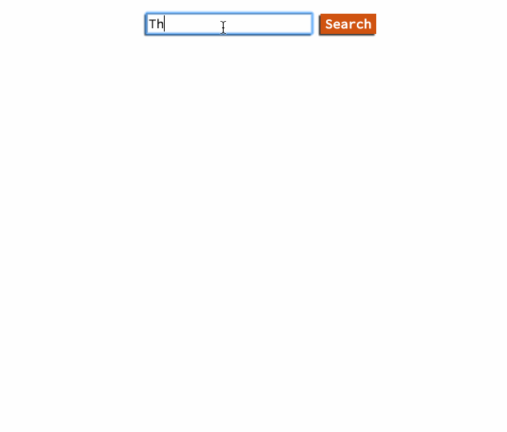

# Fa la la laaaa

## Mission
This morning we are going to use:

  - The [iTunes API](http://www.apple.com/itunes/affiliates/resources/documentation/itunes-store-web-service-search-api.html#searchexamples)
  - A Buddy
  - Your Coding Skills
  - The Power of Music

To build a super cool music app! This app will take an input of an artist and display all of their album covers, album names, and price once submitted. You got this!

## Required Steps

With a **PARTNER** complete the following:

1. Read over the  [iTunes API Documentation](http://www.apple.com/itunes/affiliates/resources/documentation/itunes-store-web-service-search-api.html#searchexamples) and make a successful Postman **GET** request with the link you'll be making the AJAX calls to.

2. Wireframe your app! Plan all of the organization and styling choices before you write a line of code.

3. Through **PAIR PROGRAMMING** (Reminder: Only one computer, with one person typing and the other person guiding), build your creation.

4. Once completed, upload it to **bitballoon** and slack it to me!

## Bonuses!

  - Add more info to the album details. What year did it come out? Is it streamable on iTunes?
  - Try to do this puppy in React. How would it change your wireframing? How would you use state/props to make the most out of your API calls?
