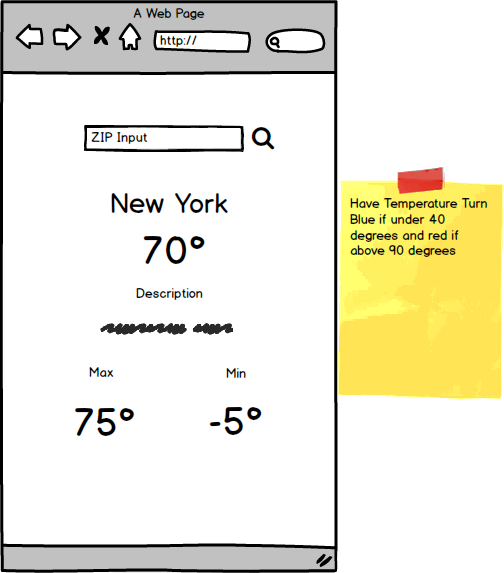

# A Mobile Weather App

Wait a second...I think I've heard that before?

Yup! You've built a mobile weather app already, BUT tonight you will rebuild it using REACT! :wink:

#### A quick reminder how your app should look:

 

### Open Weather API

Hopefully you remember working with the [Open Weather Map API](http://openweathermap.org/api).

If you don't, check out the original [README](https://github.com/ga-students/WDI_HAKUNA_MATATA/blob/master/unit02/w04_d02/homework/weatherApp/open_weather_homework_prompt.md).

**Remember** to test the url with Postman first.

### Your Mission
#### Components? State? Props? Oh my! #headspin

Build the app above using just **ONE** component. Yup, you heard right!

We will be using this HW as a foundation for a lecture tomorrow, so keep it simple and only use one component named `App` to do the following:

- Handle the zip code inputted from the user
- Fetch data from the API when a zip code is submitted
- Parse the info that comes back from the API call.
- Render that information on the page.

Things to think about:

- Should it have state?
- If so, how/when would you change state?
- What way will you make the API call?
- What terminal commands to use to set up the file structure (hint, hint - Create React App)

___

### Submission:

As always, submit an issue ticket with a link to your hw + link to bitbaloon. Please, please, **include your name is the issue title**! The instructors will not find it otherwise.

**REMINDER** YOU ARE AWESOME!!! :tada:
