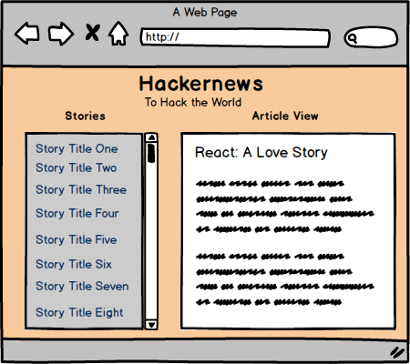

### Hack the World with...

As a developer you will always have to be up-to-date with industry news. [Hackernews](http://thehackernews.com/) is a wonderful resource for this! It also has a super duper [API](https://github.com/HackerNews/API), which you will use this weekend to build a cool Hackernews app!

### First things first!

Check out the [Hackernews API](https://github.com/HackerNews/API). It's super explicit, but still use Postman to a `GET` request and view all the data.

### Mock Up

Look familiar?

We are stealing the UI from the Pokemon App and rending Hackernews info instead. It will give you a second chance to drop kick this UI and have a cool app to use in the future!

### Deliverables

1. Your application should render news titles in a scrollbar within a div, on window load. a
2. When clicked on the title, the whole article should render.
3. Your app must be built using React, duh...
4. In your file structure, include wireframes and a mockup with component break down.
5. Style, Style it, like never before!
6. **REMINDER** Commit early! Commit often! No excuse!

### Submission:
Just as always submit an issue ticket **with your name in the title** including a link to deployed version and a link to your GihHub repo.

### Bonus!

Use the [Bootstrap](http://getbootstrap.com/) framework to style this for mobile!
