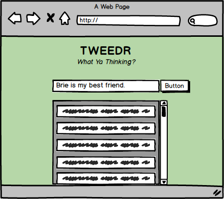

### TWEEDR


Let's make a cool new app called **Tweedr**! Not Twitter, jeez...

It's dealers choice tonight, so build this app using **React**, **a Firebase database**, and one of the following to make database requests:

[Rebase](https://github.com/tylermcginnis/re-base) (From Vinces's lecture today)

[Firebase API](https://firebase.google.com/docs/reference/rest/database/) (From Joe's lecture today)

[Axios](https://www.npmjs.com/package/axios) (From last week's lectures)

### Step I: Mock Up

You know the drill:

1. Wireframe the mock up
2. Trello your userstories
3. Trello your code tasks within the user stories

### Step II: Set Up Firebase

With [Firebase](https://firebase.google.com/):

1. Create an account and go to the console.
2. Click on **Create New Project**, name it, and create it.
3. Click on **Database**, then the second tab **Rules** to reflect the code below and publish changes.

```
{
  "rules": {
    ".read": true,
    ".write": true
  }
}
```

4. Finally click on **Data** (first tab) and you will see your database url.

**Tip!** If you are using Axios to tackle this app with `GET` or `POST` requests add `.json` at the end of your URL, to prevent CORS issues.

### Step III: Deliverables
Your React/Firebase Tweedr Application should:

1. Take an input of a Tweed.

2. Render all of the Tweeds from the database into the browser.

3. Accomplish this with **three** components:

  `App` (Hold database calls and the below components)

  `Input` (Will take a text input and on submit, throw that into a database)

  `TweedrFeed` (Will take all the text inputs from the database and reflect that in the browser)

### Submission:
Submit an issue ticket with your:
  - Github repo link (With a **TON** of git commits!)
  - Link to a deployed version
  - Your name in the title
