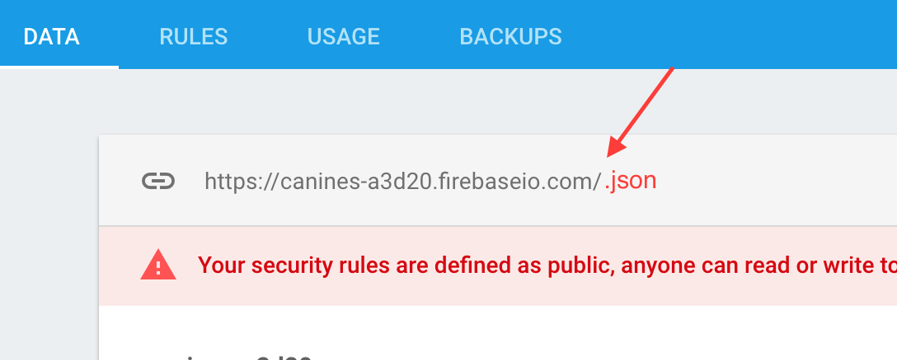
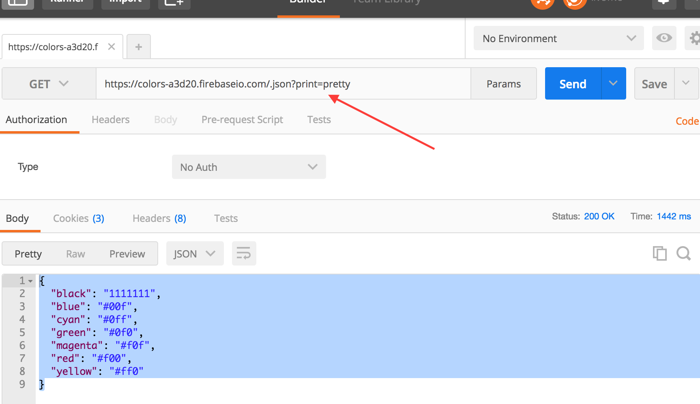
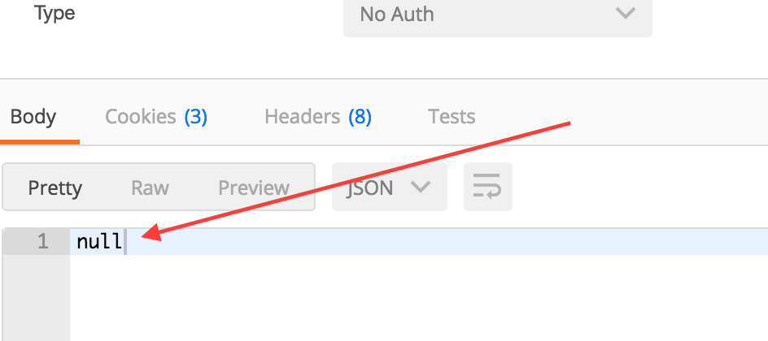
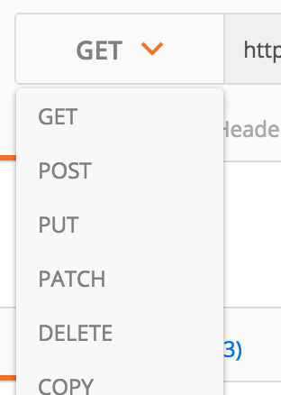

#REST LAB

## Use Postman/Firebase to play with a REST API
-  In your firebase account, create a new project called **colors**
-  Navigate to the database section
-  Click on the rules tab
-  Change rules to reflect the code below:

```
{
  "rules": {
    ".read": true,
    ".write": true
  }
}
```
Copy the url of the new database.

  

**Paste into Postman  
ALERT!! Don't forget to add `".json"` to the end of the url, when you paste it into Postman 😀**  



## View data via Postman

- Open Postman
- With the url pasted, click send. You should see a value of `null` in the return body section.





## THE GOAL
Using the following HTTP verbs (e.g, - GET, POST, PUSH, PATCH, DELETE), you will create a basic JSON structure of colors **ONLY** through Postman.



**Step 1:** (**POST, PUT OR PATCH??**) Use one of the verbs to create the JSON structure below. Don't forget to change the dropdown to correspond to the action needed on that endpoint. Feel free to add more colors.


```
{
    "red":"XXX",
    "green":"XXX",
    "blue":"XXX",
    "cyan":"XXX",
    "magenta":"XXX",
    "yellow":"XXX",
    "black":"XXX"
}
```

Once done, the main url (https://**{yourprojectDB}**.firebaseio.com/.json) should look like the above JSON structure.

**ALERT!! Don't forget to add `".json"` to the end of the url, when you paste it into postman or the browser 😀** 

**Step 2:** change black from **XXXXXX** to **#000000** via postman.
  
- To access the black resource/endpoint, you can do a **GET** (via postman) with https://{yourprojectDB}.firebaseio.com/black.json and/or view it in your browser(which defaults to GET)  

- Use the right verb to change that particular resource

### Do the same for the rest of the colors

**Step 3:** DELETE  

- Navigate (Using **GET**...) to the magenta resource/endpoint  

- Request that resource with a **DELETE** verb to remove from the set

- The main/url should now have no reference of magenta

```
{
    "red":"#f00",
    "green":"#0f0",
    "blue":"#00f",
    "cyan":"#0ff",
    "yellow":"#ff0",
    "black":"#000"
}
```

**QUESTION:** How do we do the same with [AXIOS](https://github.com/mzabriskie/axios)? Are there equivalent verbs translated as convenience methods??

relax 😌...


