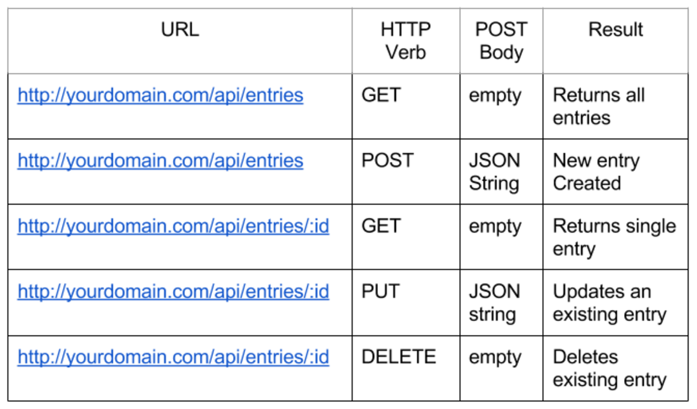
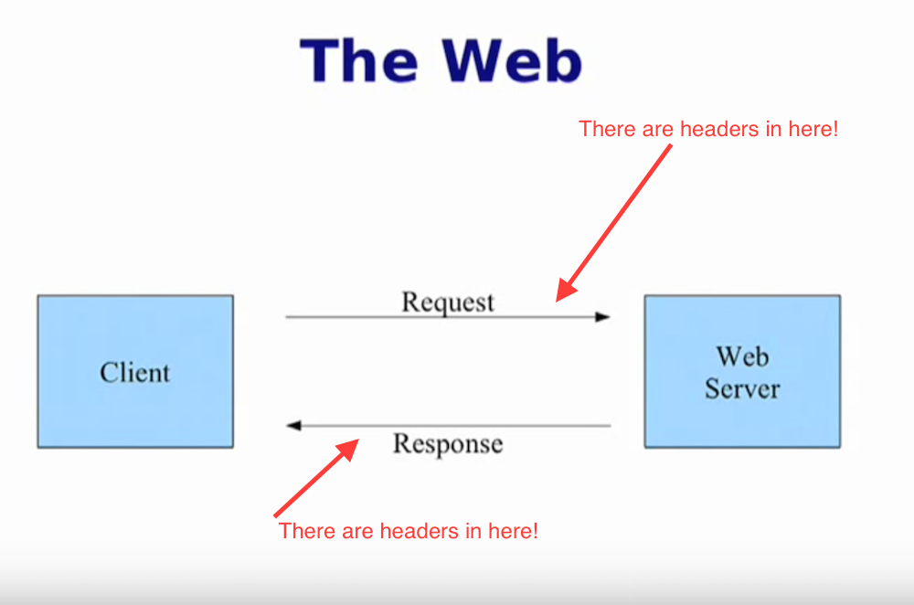

# REST

## What does **REST/Rest/REstful** mean?
 
### **RE**presentational **S**tate **T**ransfer

- **Roy Thomas Fielding** - Designer of specs/prinicipal
- A set of principles that assign how HTTP and URLs Web standards are used. (The backbone of the Internet)
- An architectural style, and an approach to communications that is often used in the development of **Web services/APIs**.
- Use http for all **CRUD** operations - **Create, Read, Update, Destroy/Delete**
 

 
##HTTP - (It's not just for serving up HTML pages)

- **H**ypertext **T**ransfer **P**rotocol
- It's a Protocol
- What are some other protocols?

###HTTP VERBS 
Each request specifies a certain HTTP verb, or method, in the request header.  

HTTP REQUEST METHODS | OPERATION
-----| -------
GET  | READ
POST | CREATE
PUT and PATCH | UPDATE
DELETE | DELETE/DESTROY

###Crud Equivalent

## Headers

## Status Codes

- **2xx** Success (e.g., 200 - The Request Succeeded)
- **3xx** Redirect (e.g., 301 - Moved Permanently)
- **4xx** Client Error (e.g., 404 - Not Found)
- **5xx** Server Error (e.g., 500 Internal Server Error)

### Terminology/Defintions
- **Endpoint:** An endpoint is a URL pattern used to communicate with an API. For example - `https://hacker-news.firebaseio.com/v0/item/8863.json?print=pretty` is one type of endpoint. 
	- A unique URL that represents an object or collection of objects.
	- [Spotify Endpoint Reference](https://developer.spotify.com/web-api/endpoint-reference/)

- **REST:** **RE**presentational **S**tate **T**ransfer
- **POJO:** Plain Old JavaScript Object
- **API:** Application Programming Interface
- **OAuth**:  An open standard for authorization, commonly used as a way for Internet users to log into third party websites using their Google, Facebook, Twitter etc. accounts without exposing their password.

## Resources
[http://apiglossary.com/](http://apiglossary.com/)   
[https://en.wikipedia.org/wiki/Hypertext_Transfer_Protocol#Request_methods](https://en.wikipedia.org/wiki/Hypertext_Transfer_Protocol#Request_methods)    
[https://en.wikipedia.org/wiki/Representational_state_transfer](https://en.wikipedia.org/wiki/Representational_state_transfer)    
[https://en.wikipedia.org/wiki/Web_API#Endpoints](https://en.wikipedia.org/wiki/Web_API#Endpoints)  
[http://www.restapitutorial.com/lessons/httpmethods.html](http://www.restapitutorial.com/lessons/httpmethods.html)

