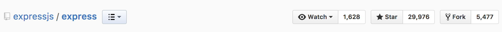

# RUBY ON RAILS

#### Some quick stats...
Rails (Ruby)

Express (JS)

Laravel (PHP)

Django (Python)

Wordpress (CMS)


#### Rails can scale out of the box like none other...
- Airbnb
- Basecamp
- Bloomberg
- CrunchBase
- Dribble
- Genius
- Github
- Groupon
- Heroku
- Hulu
- Indiegogo
- Kickstarter
- Living Social
- Shopify
- Soundcloud
- Twitch
- Urban Dictionary
- Yellow/White Pages
- Zendesk

### The point is, learn your Rails!

## Rails Philosophy

### Convention over configuration

Many other frameworks that give you a lot of flexibility. You can put folders
wherever you want, create your own naming conventions, come up with your own
best practices, etc. Rails is different.

In Rails, we adopt a philosophy of *convention over configuration*. This means
that there is a standard *rails way* of doing things - how your file structrue
should be organized, how things should be named, etc. This has many added
benefits:

1. Once you learn the Rails way, you no longer have to think about how to
   organize your application code. This frees up all of your decision making
   time and energy to work on actual feature development.
2. Rails has been around for a **long** time. The "Rails way" is the result of
   over a decade of careful consideration and refactoring by thousands of
   people. The result is an extremely cohesive framework which prioritizes
   efficiency and developer happiness. Once you get the hang of it, you'll begin
   to appreciate how elegent Rails actually is.

### The Rails way is the right way!

Don't try to go against the grain in Rails. Follow the conventions, and things
will just work. Go against them, and you will hate your life.

# Your new Bible

I am but one human. One of the amazing things about Rails (of which there are
many) is that the community is **SUPERB** when it comes to documentation.

The [Ruby on Rails Guides](http://guides.rubyonrails.org/) is the defacto resource
for all those getting into Rails, as well as seasoned pros. It is extensive,
comprehensive, and easy to read. I highly recommend you read it all the way
through, and continue to consult with it as you progress along your Rails
journey.

The [Getting Started Guide](http://guides.rubyonrails.org/getting_started.html)
can't be beat. If you do the whole thing and take your time, Rails should start
to become very intuitive for you.

# Our first Rails app

### get the latest

Before we create our first Rails app, we are going to make sure that we have the
latest version of the Rails gem. Run:
```
gem update rails
```
You might have to use sudo:
```
sudo gem update rails
```
If you don't have Rails already installed, run:
```
gem install rails
```
and you will get the latest automatically.

### rails new

To create a Rails app, we use the `rails new` command. This sets us up with our
skeleton Rails app. There are a lot of options that you can provide with the
`rails new` command. Try `rails new --help` to take a look at them all.

We are going to add some options to this command so that it
sets us up with Postgres as our database and omits the test files (the default
test suite for rails is TestUnit but the industry standard is RSpec. we'll add
rspec later)

```
rails new my_app -d postgresql -T
```

Now if we `cd my_app` and type
```
rails server
```
our Rails server will start up and we can visit our rails app at localhost:3000.

You should see an error saying that your app database does not exist!

Quit your server and run
```
rails db:create:all
```
This will create two databases for you: `my_app_development` and `my_app_test`.

Now when your run `rails server` and visit localhost:3000 you should see a
hello, world screen.

Why do we have to set up a database before we need it? This is a great example
of Rails' convention over configuration. Rails assumes that you will have a
database layer to you application (if you don't, your project probably
shouldn't be built on Rails). When the rails server starts, it automatically
connects to your database.

# Routing in Rails

Let's try to visit a new page in our app. Type `localhost:3000/welcome` into
your browsers url bar. What error do you see?

In Rails, we need to define the routes of our application in our routes file.
Edit you `config/routes.rb` file to look like this:
```ruby
Rails.application.routes.draw do
  get '/welcome', to: 'welcome#index'
end
```

This tells our Rails app that we are defining a GET route named `/welcome`. If
we go to terminal and type
```
rails routes
```
we will see a list of all of the routes that are defined in our
`config/routes.rb` file.

Now go back to the browser and refresh the page. You should see a different
error. This error is telling us that we do not have a `WelcomeController` class
definied in our app.

This is coming from the second arguement we provide to the
`get` method in our routes file. The first arguement is the name of the route
(`/welcome`) and the second arguement (`to: 'welcome#index'`) is indicating
**where** we want requests that are sent to that route to go. In Rails, the
router does not do anything with the requests, it only passes them to the
controllers. The controllers then handle the requests and sends the responses
back to the client.

# Controllers

The controllers in a Rails application handle the requests and send responses.
Controllers consist of `actions` - public instance methods that are called by
the framework when a request comes in matching the actions route.

In our app, we have stated that requests to the **GET** `/welcome` route should
be handled by the WelcomeController, specifically the `index` action within the
WelcomeController. So let's create one!

- Add a file called `welcome_controller.rb` to you `app/controllers` directory.
- Edit your `welcome_controller.rb` file to look like this:
```ruby
class WelcomeController < ApplicationController
  def index
    render text: 'Welcome!'
  end
end
```

Now when your refresh the page you should see the `Welcome!' text.

### More actions

1. Let's add a **GET** `/about` route and send it to the `WelcomeController#about`
   action. Your `about` action should render some text about yourself.
2. Add a **GET** `/people/:id` route to your routes file and add the
   corresponding controller action to your WelcomeController. This action should
   render some text with the `username` inserted. For example, if I visit **GET**
   `/people/1` I should recieve some text like "Person 1 loves Rails!". Hint:
   you're going to have to get the id from the
   [`params` object](http://guides.rubyonrails.org/action_controller_overview.html#parameters).

> That's cool brah but what if we want to render more than just text?

# Views

- First we'll start with the `index` action in our WelcomeController. Remove the
  render line (your index method will be empty).
- Visit `localhost:3000/welcome` in your browser. What error do you see?
- In your `app/views` directory, create a `welcome` folder. Inside of that create
  a `index.html.erb` file. Fill it with this:
```html
<h1>Welcome!</h1>
```
- Now refresh your browser.

> WTF?! I didn't render anything in my controller action! How did that work?

Another prime example of 'convention over configuration'! We have a
WelcomController with an `index` action defined in `app/controllers`. We have a
`app/views/welcome/` directory. In there we have an `index.html.erb`. This is
how rails likes things.

If you don't call render in your controller action, it
will call it for you automagically. It doesn't need you to tell it where the
view template is if you put it where it expects and name it after your
controller action. It just works.

Of course, if you wanted to render a different template, you could do it
explicitly in your controller action. ie:
```ruby
def index
  render :something_else
end
```
will render the `app/views/welcome/something_else.html.erb` template.

> Why don't we have to include and html boilderplate in our templates?

Good question! Rails renders your templates in `layouts`. Checkout
`app/views/layouts/application.html.erb`. If you add something here, it will be
rendered on every page. The templates themselves are rendered through the `yeild`
in the body tag.

### More views

Add the remaining views for the `about` and `people` controller actions. To make
the `name` available, you are going to have to set it to an instance variable in
your controller action. Then in your template, you will have access to that
instance variable. Good news! The default template compiler for Rails
applications, ERB, has the **exact same syntax** as EJS (yes, we did that on
purpose).

# Route Helpers

Another godly thing about Rails is that it provides your with url helper methods
so that you don't have to remember every every route in your app. Add the
following line to your `app/views/welcome/index.html.erb` template:
```html
<%= link_to 'About', about_path %>
```
There are two magics going on here -
1. `link_to` is a method available in Rails views that create anchor tags. The
   first argument is the text that will be displayed in the link. The second is
   the href for the link.
2. `about_path` is a url helper method that returns the about path, or rather,
   the path that will resolve to the about route defined in our routes
   controller.

Try adding a link to the `people` action in our WelcomeController. Notice that
this route has a name in it. If you have a route with a variable value in it,
you can pass that value as an arguement into the url helper method for that
route.

# Persisting Data - ActiveRecord

Our `people` route should really return some data about the person record who's
id matches the one provided in the url. To communicate with databases, Rails has
a defualt ORM called ActiveRecord.

Go to your routes file and change the `get '/people'` line to:
``` ruby
resources :people
```
No run `rails routes` to see what that does. As you can see, the resources
router method creates all of the standard CRUD endpoints for the resource you
declair (in our case, people).

Now visit `localhost:3000/people/1` in your browser. What happens?

Create a PeopleCntroller class just like we created our welcome controller. It
will need **7 controller actions**, `index`, `new`, `create`, `show`, `edit`,
`update` and `destroy`. These controller actions correspond to the 7 routes that
were added when we added the `resources :people` line to our routes file.

> Quiz: Which controller action is called when we visit `/people/1` in our
> browser?

### Adding people

1. Add a link to the welcome page to the new person form. Hint: use the
   `link_to` and `new_person_path` url helper methods in an ERB tag.
2. Create a `app/views/people/new.html.erb` template. This will be the form that we
   use to create people records.
3. Make a form that **POST**s to `/people` (use the `people_path` url helper
   method here too). The form can have 3 inputs, `username`, `first_name` and
   `last_name`. There is a specail way to name these inputs so that the Rails
   body parser can provide them in a neat ruby hash in your controller. If you
   want an input to map to the username attribute on the person model, the name
   of the input should look like this:
   ```html
   <input type="text" name="person[username]" />
   ```
4. You also have to add this hidden input to your form:
   ```html
   <input type="hidden" name="authenticity_token" value="<%= form_authenticity_token %>" />
   ```
5. What happens when you submit the form?

We need some way to persist the form data for new people. 

```
rails generate model people
```

That will create a `create_people` migration which, when run, will create the
people table in our database. It will also create a `People` class in our
`app/models` directory.

Open up your new migration file in the `db/migrate` directory and edit it to
look like this:
```ruby
class CreatePeople < ActiveRecord::Migration[5.0]
  def change
    create_table :people do |t|
      t.string :username, unique: true
      t.string :first_name
      t.string :last_name

      t.timestamps
    end
  end
end
```

The `unique: true` option creates a unique constraint on out database that
doesn't allow duplicate values for the username column of the people table.

Now run
```
rails db:migrate
```

In the create action of our controller, we should now be able to use the Person
class to save our form data.
```ruby
def create
  @person = Person.new(params[:person])
 
  @person.save
  redirect_to @person
end
```

This creates a new instance of the person class with the values provided from
the form. The `@person.save` will persist the person values to the database if
there are no errors. Finally, we redirect to the person show page.

### Showing people

Now in the person show action, we need to look up the person based on the id
provided in the url - **GET** `/people/1` should render a show page for the
person with id 1.

We will use the `ActiveRecord.find` class method to look up the person.
```ruby
def show
  @person = Person.find(params[:id]) 
end
```

Remeber, the controller will default to rendering the template with the same
name, so you don't have to render anything. Create your show template and render
the details of the person!

# Completing the CRUD

On your own or in pairs, finish adding the CRUD functionality for the people
resources.

1. Index - shows list of all people
2. Edit - shows edit form (pre filled) for single person
3. Update - PUT action that takes the info from the edit form for a person
   and makes the correct updates in the database.
4. Destroy - Deletes a person

These references will help a lot:

- [ActiveRecord CRUD](http://guides.rubyonrails.org/active_record_basics.html#crud-reading-and-writing-data)
- [ActiveRecord Query Interfact](http://guides.rubyonrails.org/active_record_querying.html)

